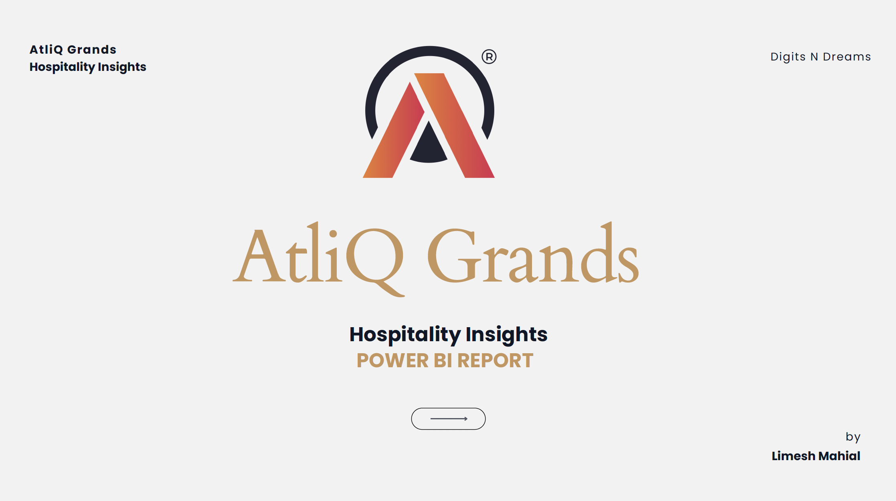
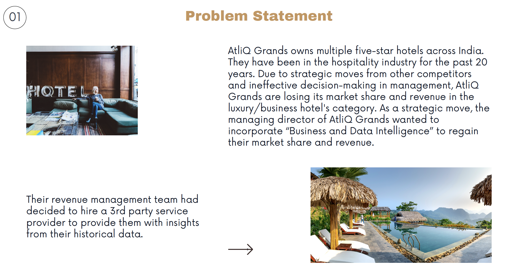
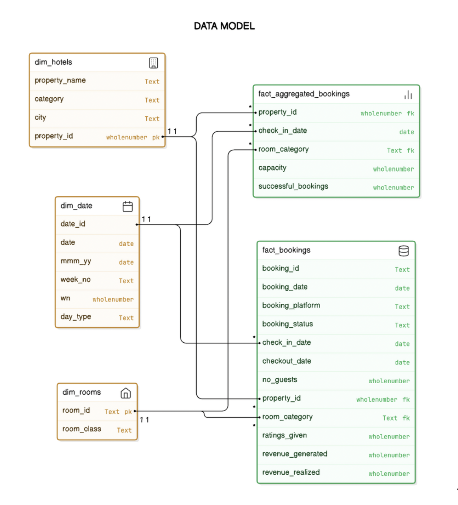
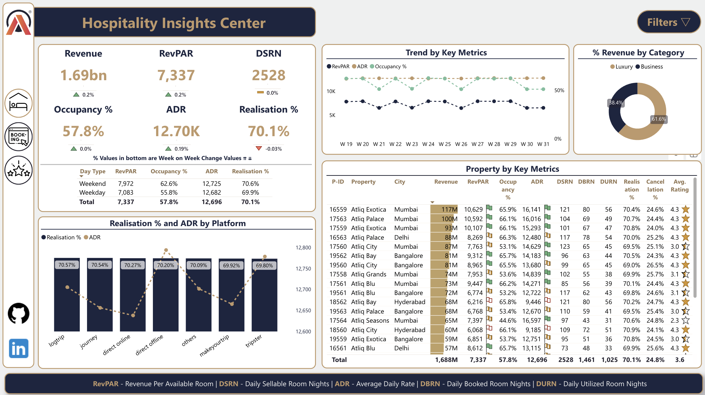

# Hospitality Insights for AtliQ Grands

 <!-- Add a high-quality banner image with AtliQ Grands logo and title -->

## Project Overview

**Hospitality Insights for AtliQ Grands** is a Power BI project that provides data-driven insights into hotel performance metrics, guest behavior, and revenue trends. AtliQ Grands, a luxury hotel chain in India, is facing challenges in maintaining market share and revenue. This project equips stakeholders with valuable insights to make informed strategic decisions.

## Table of Contents
- [Problem Statement](#problem-statement)
- [Business Objectives](#business-objectives)
- [Data Model](#data-model)
- [Key Insights](#key-insights)
- [Recommendations](#recommendations)
- [Report Access](#report-access)
- [Contact](#contact)

---

## Problem Statement

Due to increased competition and suboptimal decision-making, AtliQ Grands has experienced a decline in market share and revenue. This project addresses these challenges by providing insights into revenue insights, booking trends, and guest satisfaction.

 <!-- Include an image showing the market share decline or competitive pressures -->

## Business Objectives

1. **Revenue Recovery:** Analyze revenue patterns to boost financial performance.
2. **Occupancy Optimization:** Investigate occupancy rates across various room types and locations.
3. **Guest Experience Enhancement:** Track customer satisfaction and focus on service improvements.

---

## Data Model

The data model includes dimensions and fact tables to support analysis across various performance metrics. Key components are:

- **Dimensions:** `dim_date`, `dim_hotels`, and `dim_rooms`
- **Facts:** `fact_aggregated_booking`, `fact_bookings`

 <!-- Add a Power BI data model screenshot showing table relationships -->

---

## Key Insights

1. **Revenue Trends:** Weekly growth observed, with higher demand on weekends.
2. **High ADR on Direct Bookings:** Higher average revenue per room for direct bookings.
3. **Platform Performance:** Logtrip and Journey platforms have lower cancellation rates, reducing revenue leakage.

## Recommendations

1. **Promote Weekday Packages** for business travelers to increase occupancy during off-peak times.
2. **Strengthen Partnerships** with high-realization platforms to reduce cancellations.
3. **Enhance Direct Booking Channels** with exclusive offers to increase revenue from high-ADR sources.

---

## Report Access

The interactive report is hosted online. Access it via the following link:

[Hospitality Insights Power BI Report](https://app.powerbi.com/view?r=eyJrIjoiOTUxYWZmMDAtNzAyOS00NWU0LTkwNjEtYmJmMzQwZmIwNTVkIiwidCI6IjcwZjQ5MWZkLTA3ODAtNDNhOS1iOTRmLThjZmEzOTlkZWRkOCJ9&pageName=9422bde68ad87d697067) <!-- Insert direct Power BI report link -->

Check out the [presentation](PBI_Hospitality_Insights.pdf) for a complete breakdown of the dashboard, featuring data-driven insights and recommendations based on the gathered findings.

---

## Contact

For questions, suggestions, or collaboration:

- **Limesh Mahial** 
  [LinkedIn](https://www.linkedin.com/in/lmahial)

---
Data nerds, keep querying, keep designing, and most importantly, keep having fun! Until next time—see you around!

